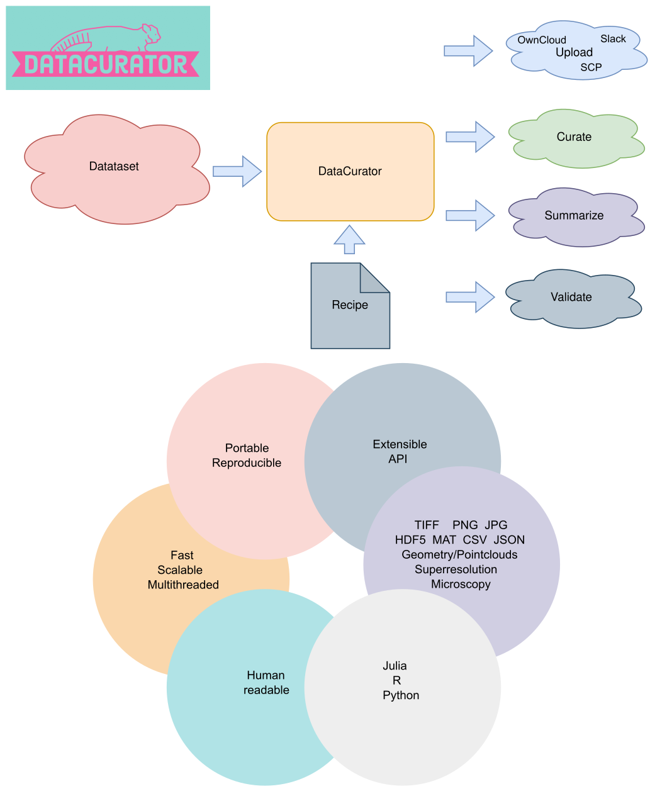

# DataCurator



A multithreaded package to validate, curate, and transform large heterogeneous datasets using reproducible recipes, which can be created both in TOML human readable format, or in Julia.

A key aim of this package is that recipes can be read/written by any researcher without the need for being able to write code, making data sharing/validation faster, more accurate, and reproducible.

DataCurator is a Swiss army knife that ensures:
- pipelines can focus on the algorithm/problem solving
- human readable `recipes` for future reproducibility
- validation huge datasets at high speed
- out-of-the-box operation without the need for code or dependencies

## Preprint
You can find our preprint [here](https://www.researchgate.net/publication/368557426_DataCuratorjl_Efficient_portable_and_reproducible_validation_curation_and_transformation_of_large_heterogeneous_datasets_using_human-readable_recipes_compiled_into_machine_verifiable_templates)

<!--  -->

<!--  -->

[](https://doi.org/10.5281/zenodo.7527517)

## Status

[](https://dl.circleci.com/status-badge/redirect/gh/bencardoen/DataCurator.jl/tree/main)

[](https://codecov.io/gh/bencardoen/DataCurator.jl)

## Singularity Image

You can find the container image at [Sylabs](https://cloud.sylabs.io/library/bcvcsert/datacurator/datacurator)

## Documentation
### Markdown
[](https://github.com/bencardoen/DataCurator.jl/blob/main/docs/src/index.md) (clickable link)
The documentation in markdown makes it easier to reuse code snippets.
See [documentation source folder](https://github.com/bencardoen/DataCurator.jl/blob/main/docs/src/index.md) and the [examples](https://github.com/bencardoen/DataCurator.jl/blob/main/example_recipes)

## What to find where
```bash
repository
├── example_recipes              ## Start here for easy to copy example recipes
├── docs
│   ├── builds
│   │   ├── index.html           ## Documentation
│   ├── src                      ## Markdown sources for docs
│   │   ├── make.jl              ## `cd docs && julia --project=.. make.jl` to rebuild docs
├── singularity                  ## Singularity image instructions
├── src                          ## source code of the package itself
├── scripts                      ## Utility scripts to run DC, generate test data, ...
├── test                         ## test suite and related files
└── runjulia.sh                  ## Required for Singularity image
└── buildimage.sh                ## Rebuilds singularity image for you (Needs root !!)
```


## Table of Contents
1. [Quickstart](#quickstart)
2. [Troubleshooting](#faq)

<a name="installation"></a>
## Quickstart
For a complete walkthrough, please see the [documentation](https://github.com/bencardoen/DataCurator.jl/blob/main/docs/src/index.md).
The below steps work if you have access to a command line environment (WSL on Windows, Bash on Linux/MacOs). 
This assumes you have completed the [installation](https://github.com/bencardoen/DataCurator.jl/blob/main/docs/src/installation.md).
If not, please do this first.
 
 
#### Downloading the container
```bash
singularity pull --arch amd64 library://bcvcsert/datacurator/datacurator:latest
```
#### Set executable
```bash
chmod u+x ./datacurator.sif
```
#### Copy an example recipe
```bash
 wget https://raw.githubusercontent.com/bencardoen/DataCurator.jl/main/example_recipes/count.toml
```
#### Create test data
```bash
mkdir testdir
touch testdir/text.txt
```
#### Run
```bash
./datacurator.sif -r count.toml
```

That should show output similar to


The recipe used can be found [here](https://raw.githubusercontent.com/bencardoen/DataCurator.jl/main/example_recipes/count.toml)

<a name="faq"></a>
## Troubleshooting
If you have any issue, please search [the issues](https://github.com/bencardoen/DataCurator.jl/issues) to see if your problem has been encountered before. 
If not, please [create a new issue](https://github.com/bencardoen/DataCurator.jl/issues/new/choose), and follow the templates for bugs and / or features you wish to be added.

If you have a workflow that DataCurator right now does not support, or not the way you'd like it to, you can mention this too. In that case, do share a **minimum** example of your data so we can add, upon completion of the feature, a new testcase.

## Dependencies
DataCurator relies heavily on existing Julia packages for specialized functionality:
- [Images.jl](https://github.com/JuliaImages/Images.jl)
- [DataFrames.jl](https://dataframes.juliadata.org/stable/)
- [CSV.jl](https://csv.juliadata.org/stable/)
- [RCall.jl](https://github.com/JuliaInterop/RCall.jl)
- [PyCall.jl](https://github.com/JuliaPy/PyCall.jl)

## Related software
- [Open Microscopy OMERO](https://www.openmicroscopy.org/omero/)
